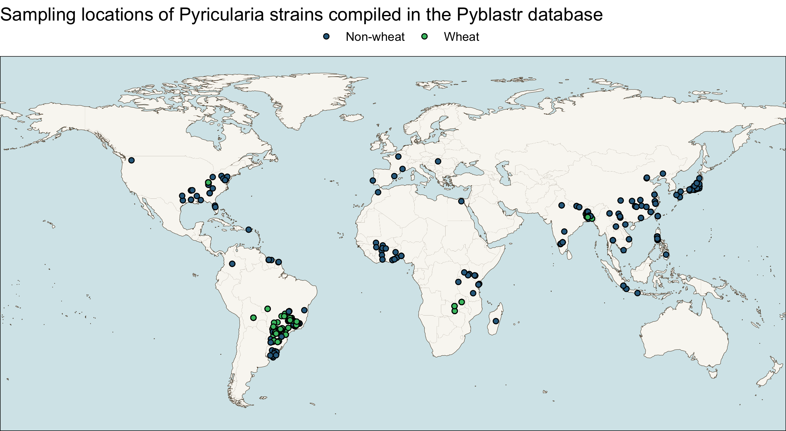

# Pyblastr

This fork of the Pyblastr repository gets rid of everything that is needed to build the website and focuses on extracting the underlying data aswell as creating a couple of simple summary statistic and a map plot.

